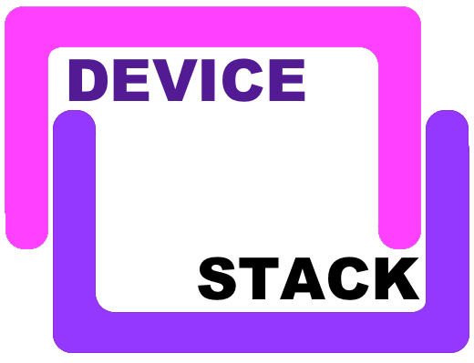
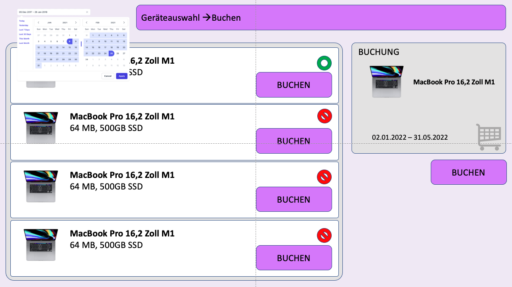

 
# DeviceSTACK

## Hardware Verleih
Für den Hardware-Verleih wird eine Verleih-Plattform benötigt.
Die leihbaren Geräte sind vornehmlich für Bereich der Ausbildung vorgesehen, den Auszubildenden soll ermöglicht werden, verschiedene Geräte zum Einsatz in der Ausbildung auszuleihen.

## Datenpflege
### Hardwareverwaltung (QR Codes)
In der Hardwareverwaltung werden die Geräte verwaltet, so können in diesem Modul Hardware hinzugefügt, geändert und gelöscht werden. Alle Geräte werden mit einem QR-Code ausgestattet, über den Detailinformationen über das Gerät und dessen Status abrufbar sind.

Folgende Daten müssen verwaltet werden:

- Device ID
- Device Name
- Device Beschreibung
- Anschaffungspreis
- Leihkosten (EUR/Tag für später Erweiterung zum Verbuchen auf Kostenstelle)
- Device Image
- Firmware/Betriebssystem Version (wenn das Gerät so etwas hat)
- Interne Anmerkung (z.B. Geräte-Zustand)
- Seriennummer
- Aktueller Status (verfügbar, ausgeliehen, defekt, verloren, ...)
- Anschaffungstermin
- begin of Life (Datum an dem das Gerät gebaut wurde)
- End of Life (Datum, an dem das Gerät das Nutzungsende erreicht hat)
- Zuletzt verliehen
- Verleihdauer (Gesamt-Tage, an denen das Gerät verliehen war)

! Es ist zu berücksichtigen, dass es von einem Gerät mehrere Stückzahlen gibt und mit unterschiedlichen Eigenschaften.

### Mitarbeiterverwaltung
Der Mitarbeiter kann sich über eine Registrierung an dem System registrieren. Ist die Registrierung durch einen Verleiher (Mitarbeiter in der Lehrwerkstatt) autorisiert, kann der Mitarbeiter Geräte reservieren und ausleihen.

Für die Registrierung sind folgende Daten erforderlich:

- Vorname, Nachname
- E-Mail-Adresse
- Mitarbeiter ID
- Mitarbeiter Ausweis ID
- Passwort

! In einer späteren Ausbaustufe wird diese Registrierung durch eine Authentifizierung per SIAM erfolgen.

## Vorgangsmanagement
### Geräte Übersicht
Über die Geräteübersicht kann der Mitarbeiter das gewünschte Gerät suchen, auswählen und die Verfügbarkeit einsehen.

 
Bild: 001

### Buchungskalender
Für die Buchung ist ein Buchungskalender erforderlich. Bei der Buchung durch den Mitarbeiter wird dieser durch einen Datepicker bereitgestellt.
Für den Lehrwerkstatt-Mitarbeiter ist der Buchbuchungskalender ähnlich der Terminplanung in Teams/Outlook zu implementieren.

### Buchungen, Reservierungen
Neben der Buchungen vor Ort ist auch eine Reservierung und Buchung  online zu implementieren.
Bei Übergabe vor Ort soll ein Fotoprotokoll, bestehend aus Gerät mit Seriennummer und Mitarbeiter Ausweis, erstellt werden. Dieses Fotoprotokoll ist als Dokument dem Verleihvorgang hinzuzufügen.

## Kommunikation
### Buchungsbestätigungen
Bei jeder Ausleihe und Rückgabe wird eine Bestätigung, per E-Mail, an den Mitarbeiter versendet.

### Automatische Erinnerungen (optional)
Erinnerung zur Rückgabe der Hardware erfolgt per E-Mail.
Die Zeitspanne für die Erinnerung ist in den Stammdaten einstellbar zu hinterlegen.

### Benutzer- und Rollenverwaltung
Für die Verwaltung der Software sind drei Rollen vorgesehen. In der ersten Version verwenden wir eine eigne Benutzer- und Rollenverwaltung, zu einem späteren Zeitpunkt ist ein Anbindung and den SIT internen IDP (SIAM) geplant.

- Administrator
- Verleiher (Mitarbeiter in der Lehrwerkstatt)
- Mitarbeiter

## Sonstiges
###  Reporting - Auswertungslisten (optional)
Übersicht über den Verleih-Status der Geräte.

### Digitale Übergaben und Rücknahmen(optional)
Neben der physischen Übergabe und Rücknahme soll auch eine digitale Variante implementiert werden, hierbei erfolgt der Austausch der Geräte auf dem Postweg.

### Daten-Import/Export (optional)
Gerätedaten können über eine Restschnittstelle importiert und exportiert werden.
Die Restschnittstelle ist sicherheitstechnisch abzusichern.

### Aktivitätsprotokoll (optional)
Protokollierung der Zugriffe auf die Applikation.

- Änderungen an den Stammdaten
- Mitarbeiter Operationen 
